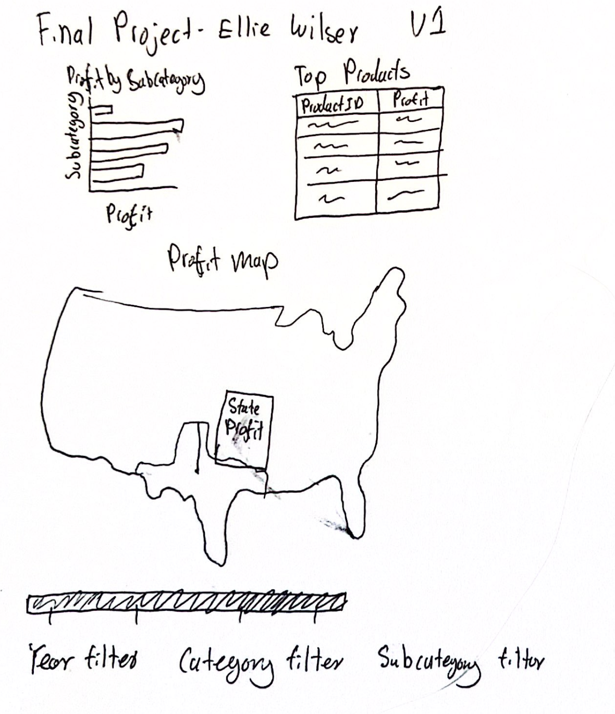
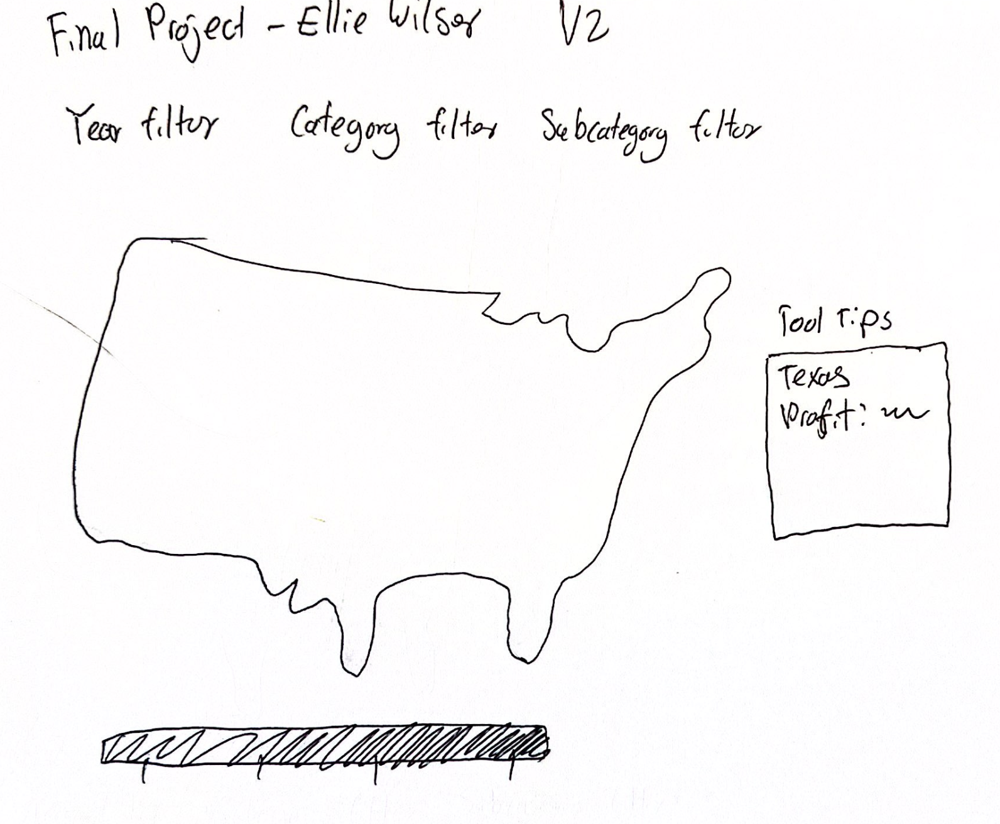
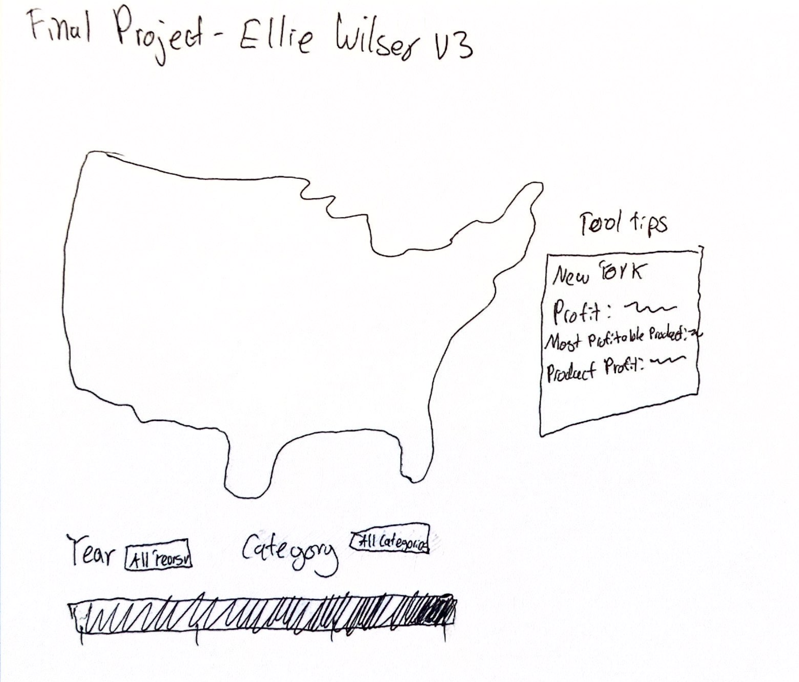

# Final-Project-Data-Vis
## Final Project Documentation
# Ellie Wilser

When I started creating my visualization, I wanted to answer, “What states produce the most profit from sales, and what products are the top profiting products?” As you will see, I started off with very complex visuals, and I decided to simplify, not due to a lack of coding skill but because of ease of reading. I wanted my audience to see what states produced the most profits, what years were the most profitable, and what categories generated the most profit.

### Design Process

#### Version 1

For my first version, I wanted to try and include as many visualizations as possible. I realized that all these different charts and graphs made the page overwhelming to look at. So, I decided to just go with the map because it was the most important to me to show which states were the most profitable. At this point in the process, I thought I was going to give up on showing profit by category, year, and the top-selling products.

#### Version 2

In version 2, you can see how simplified the visualization got after getting ride of the bar graph and the chart. This was to simple for me, and I wasn’t going to give up on the other parts of my questions.

#### Version 3 / Final Version

The main difference between version 3, and version 2 is the top products included in the tooltips for the map. After doing some research on tooltips in D3, I learned I could aggregate data inside of the tooltips which allowed me to include other information besides state name and profit. At this stage, I perfected the filters which allowed the user to see the differences in profit by each year and category. I also removed the subcategory because I found it to be a little too niche.
